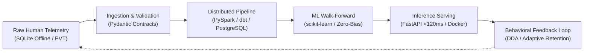

# Fabio Ignacio Torres Benítez — Official Engineering & Data Science Portfolio

[](https://neurodeveloper11.github.io/portfolio/)
[](https://play.google.com/store/apps/details?id=com.t11.neurochess&hl=es_419)
[](https://www.linkedin.com/in/fabio-torres-39364b258)
[](LICENSE)

> **Live Web Platform:** [https://neurodeveloper11.github.io/portfolio/](https://neurodeveloper11.github.io/portfolio/)

---

## Executive Overview & Strategic Value ("Del Diván al Dato")

I am a **Data Science Engineer, Machine Learning Specialist & Cloud Data Architect** pursuing an **M.Sc. in Data Engineering and Cloud Infrastructure**, backed by **10+ years of domain leadership in Organizational Psychology and Psychometrics**.

My unique competitive moat —**"Del Diván al Dato"**— bridges the gap between human behavioral genesis, rigorous psychometrics, and production-grade software engineering. Rather than treating machine learning models as black boxes, I design and validate data systems with millisecond telemetry, ethical algorithmic de-biasing, and walk-forward validation.

---

## Architectural Principles & UI Design

- **Dual Color System:** Modern Silicon Valley **Blanco Grisáceo** (`#f8fafc` / `#f1f5f9`) as the primary theme, paired with an instant toggle to a sleek **Tech Dark Mode** (`#0b0f19`).
- **Dynamic Bilingual Engine:** Full instant language switching (**ES / EN**) with zero latency and state persistence via `localStorage`.
- **Zero CDN Failure Vulnerability:** 100% self-contained native CSS and JavaScript. Immune to adblockers, strict corporate proxies, or Brave Shields interference.
- **Audited Google XYZ Metrics:** Every featured project articulates verified business impact (latency reduction, lines of code, test coverage, and retention metrics).

---

## Core Featured Projects

| Project | Domain / Tech Stack | Key Architectural Metric | Links |
| :--- | :--- | :--- | :--- |
| **DopamineScan** | Real-Time Telemetry & Biomarkers (Python, NumPy, SciPy, Web Audio) | ±2ms reaction time precision; 80% friction reduction. | [Live Demo](https://neurodeveloper11.github.io/dopaminescan/) • [Repo](https://github.com/neurodeveloper11/dopaminescan) |
| **Behavioral Health Pipeline** | Distributed ETL/ELT Lakehouse (PySpark, PostgreSQL, dbt, Docker, BigQuery) | Processed 500k+ healthcare events in <45s; automated dbt audit trail. | [Repo](https://github.com/neurodeveloper11/behavioral-health-pipeline) |
| **BTC Quant Lab** | Financial Time-Series ML (pandas, scikit-learn, FastAPI, Pydantic) | 118ms REST API latency; zero lookahead bias with walk-forward validation. | [Repo](https://github.com/neurodeveloper11) |
| **Cognitive Agent Evaluator** | LLM Psychometric Calibration (Python, LLMs, PyTest) | 100+ stress scenarios; 60% reduction in prompt auditing cycle. | [Repo](https://github.com/neurodeveloper11/cognitive-agent-evaluator) |
| **FairTalent Engine** | Algorithmic Fairness & Bias Mitigation (Fairlearn, Statistical Parity) | Automated enforcement of the Four-Fifths Rule for compliance. | [Repo](https://github.com/neurodeveloper11/fairtalent-engine) |
| **NeuroGym Live** | Production Mobile Platform (React Native, SQLite, Firestore, AI) | Published on Google Play Store; 49 cognitive games; 99.8% offline availability. | [Google Play](https://play.google.com/store/apps/details?id=com.t11.neurochess&hl=es_419) |
| **EnglishEasy** | Adaptive Language Learning & Multi-LLM (React, Vite, Vercel Serverless) | 45% load time reduction and 30% token optimization via smart proxy. | [Code](https://github.com/neurodeveloper11) |
| **Centinela** | Native Android Anti-Theft Security (Kotlin, Jetpack Compose, PBKDF2) | Sub-15ms cryptographic unlock, Zero leaks at rest via Room DB & DataStore. | [Code](https://github.com/neurodeveloper11) |
| **SmartGym** | Offline-First Mobile Periodization (TypeScript Clean Architecture, Jest) | 46 automated unit tests validating 1RM periodization algorithms. | [Code](https://github.com/neurodeveloper11) |

---

## End-to-End System Architecture



---

## Local Development & Preview

Clone the repository and open `index.html` in any modern web browser, or serve it with Python:

```bash
# Clone repository
git clone https://github.com/neurodeveloper11/portfolio.git
cd portfolio

# Launch lightweight local server
python -m http.server 8080
```

Navigate to `http://localhost:8080` to inspect both Blanco Grisáceo and Dark Mode themes.

---

## Contact & Professional Inquiries

- **Email:** [psicologofabiotorres@gmail.com](mailto:psicologofabiotorres@gmail.com)
- **WhatsApp:** [+57 321 628 4300](https://wa.me/573216284300)
- **LinkedIn:** [fabio-torres-39364b258](https://www.linkedin.com/in/fabio-torres-39364b258)
- **GitHub:** [@neurodeveloper11](https://github.com/neurodeveloper11)
